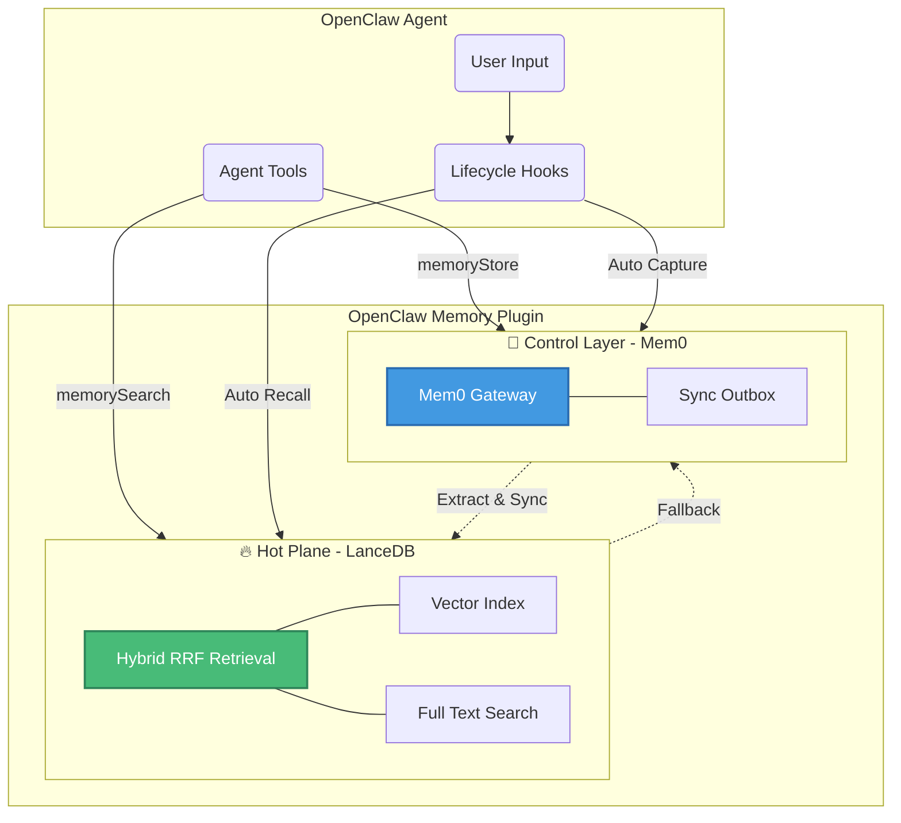

<div align="center">
  <h1>OpenClaw Memory Plugin</h1>
  <p><strong>🧠 Supercharge your AI Agents with Persistent, Smart Memory 🧠</strong></p>
  <p>
    <a href="./README.zh-CN.md">中文说明 (Chinese)</a>
  </p>
</div>

---

**OpenClaw-Mem0-LanceDB** is an advanced memory plugin that gives your OpenClaw agents long-term recall and continuous learning capabilities. It seamlessly combines **[Mem0](https://github.com/mem0ai/mem0)** as the intelligent control plane for memory extraction/management and **[LanceDB](https://github.com/lancedb/lancedb)** as the ultra-fast retrieval hot plane using vector and full-text search.

Whether you are a beginner looking to give your agent a persistent identity, or a senior engineer building scalable multi-agent systems, this plugin scales with your needs.

---

## 🏗️ Architecture Overview

The plugin uses a **local-first memory architecture** designed for fast recall, explicit maintenance, and low operational overhead.



### The Three Layers
1. **🔥 Local Memory Layer (LanceDB)**: The primary local memory state and retrieval surface. It powers hybrid recall with vector search, full-text search, and reranking-friendly candidate generation.
2. **🧠 Control Layer (Mem0)**: Handles memory extraction, governance, and optional remote synchronization.
3. **📦 Sync State Layer (Outbox)**: Tracks pending sync work without introducing a second source of truth. LanceDB remains the local state authority.

---

## 🚀 Quick Start (For Beginners)

Get your agent remembering in seconds!

### 1. Installation

Run the installation script in your OpenClaw workspace:

```bash
cd plugins/openclaw-mem0-lancedb
bash scripts/install.sh
```

### 2. Configuration

Add the plugin to your `openclaw.json` config file. Here is the minimal recommended setup using a local Mem0 server:

```json
{
  "plugins": {
    "slots": {
      "memory": "openclaw-mem0-lancedb"
    },
    "entries": {
      "openclaw-mem0-lancedb": {
        "enabled": true,
        "config": {
          "mem0": {
            "mode": "local",
            "baseUrl": "http://127.0.0.1:8000",
            "apiKey": ""
          },
          "lancedbPath": "~/.openclaw/workspace/data/memory/lancedb",
          "outboxDbPath": "~/.openclaw/workspace/data/memory/outbox.json",
          "autoRecall": {
            "enabled": true,
            "topK": 5
          },
          "autoCapture": {
            "enabled": true
          }
        }
      }
    }
  }
}
```

*Tip: Enable `autoCapture` and `autoRecall` to run the plugin in its normal hook-first mode. The agent can save and recall memories without explicit tool calls.*

### Recommended: Voyage AI (Best for RAG)

For production use cases requiring highly accurate semantic retrieval, we strongly recommend using [Voyage AI](https://www.voyageai.com/) for both embeddings and reranking.

---

## 🤖 Hook-First Runtime

This plugin is designed as a **hook-first memory sidecar** for OpenClaw. In normal operation, hooks are the primary interface and tools are optional operator utilities.

If your OpenClaw host supports standard hooks (`before_prompt_build`, `agent_end`), the plugin operates autonomously:

### 📥 Auto Capture (Primary Write Path)
At the end of a turn (`agent_end`), if enabled, the plugin submits the `User + Assistant` conversation to Mem0. Mem0 extracts facts, preferences, and profile changes. The result is then synced into LanceDB as local memory state.

### 📤 Auto Recall (Primary Read Path)
Before the agent replies (`before_prompt_build`), the plugin searches the hot plane using the latest user query. Relevant memories are injected into the prompt context automatically, so the model does not need to remember to call a search tool.

### 🔁 Explicit Maintenance
Hooks own the dialogue-time path. Heavy maintenance is explicit rather than always-on:

- startup performs lightweight preflight checks
- `memory_maintain` runs sync, migration, consolidation, or lifecycle tasks on demand
- routine recall and capture stay focused on the end-to-end memory path

---

## 🛠️ Admin/Debug Tools (For Operators And Developers)

### 🔍 `memory_search` & `memorySearch`
Manual operator/debug retrieval tools. They query the LanceDB Hot Plane using Hybrid Search (Vector + BM25 FTS) and can fall back to Mem0 if results are scarce.

```json
{
  "query": "user's dietary preferences",
  "userId": "user_123",
  "topK": 5,
  "filters": {
    "scope": "long-term",
    "categories": ["preference"]
  }
}
```

### 💾 `memoryStore`
Manual admin write path for repair, import, and controlled testing. The write path preserves the normal sync chain:
`Operator -> Local Outbox -> Mem0 Control Layer -> LanceDB Local Memory Layer`

```json
{
  "text": "The user allergic to peanuts.",
  "userId": "user_123",
  "scope": "long-term",
  "categories": ["preference", "health"]
}
```

### 📖 `memory_get`
Reads stored memory records directly from LanceDB for diagnostics or targeted inspection.

---

## 🔧 Local Development & Testing

Debugging remote memory services can be tedious. We bundle a Local Mem0 API server to make hacking easy.

1. **Prerequisites**: Install `uv` (`pip install uv` or via homebrew).
2. **Setup**: Run `npm run mem0:setup` to spawn an isolated virtual environment and install dependencies (including `google-genai` for local Gemini embedding fallback).
3. **Start**: Run `npm run mem0:start` (listens on `127.0.0.1:8000`).

The local server seamlessly reads your `~/.openclaw/openclaw.json` to reuse your existing LLM defaults (`agents.defaults.memorySearch`) for embeddings.

### Developer Commands
```bash
npm install      # Install JS dependencies
npm run dev      # Compile TS on the fly
npm run build    # Build output bundle
npm test         # Run unit test suite
```
