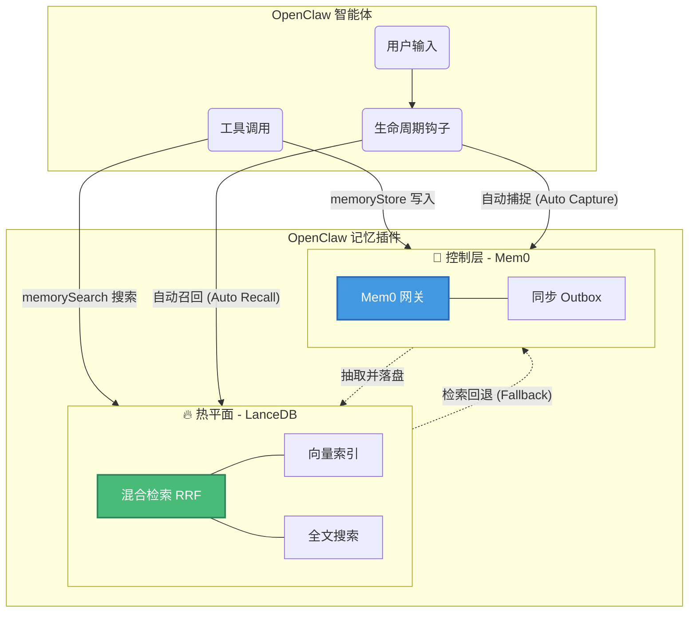

<div align="center">
  <h1>OpenClaw 记忆插件 (Mem0 + LanceDB)</h1>
  <p><strong>🧠 为你的 AI 智能体注入持久化、智能化的长期记忆 🧠</strong></p>
  <p>
    <a href="./README.md">English Documentation</a>
  </p>
</div>

---

**OpenClaw-Mem0-LanceDB** 是一款高级记忆插件，赋予 OpenClaw 智能体长期记忆与持续学习的能力。它完美结合了 **[Mem0](https://github.com/mem0ai/mem0)**（作为智能的控制面进行记忆抽取和管理）与 **[LanceDB](https://github.com/lancedb/lancedb)**（作为基于向量和全文检索的极速检索热面）。

无论你是希望赋予 Agent 稳定人设的初学者，还是正在构建可扩展多智能体系统的资深研发人员，本插件都能满足你的需求。

---

## 🏗️ 架构概览 (Architecture Overview)

本插件采用**本地优先的记忆架构**，目标是提升召回速度、降低运行时复杂度，并把维护动作收敛为显式流程。



### 核心三层设计
1. **🔥 本地记忆层（LanceDB）**：本地主状态与主检索面，负责混合召回、候选生成和上下文注入。
2. **🧠 控制层（Mem0）**：负责记忆抽取、治理以及可选的远端同步。
3. **📦 同步状态层（Outbox）**：只负责记录待同步工作，不再承担第二事实源；本地状态以 LanceDB 为准。

---

## 🚀 快速开始 (适合初学者)

让你的 Agent 瞬间拥有记忆！

### 1. 安装

在 OpenClaw 工作区中运行安装脚本：

```bash
cd plugins/openclaw-mem0-lancedb
bash scripts/install.sh
```

### 2. 配置

在 `openclaw.json` 配置中添加本插件。以下是推荐的极简配置（使用本地 Mem0 服务）：

```json
{
  "plugins": {
    "slots": {
      "memory": "openclaw-mem0-lancedb"
    },
    "entries": {
      "openclaw-mem0-lancedb": {
        "enabled": true,
        "config": {
          "mem0": {
            "mode": "local",
            "baseUrl": "http://127.0.0.1:8000",
            "apiKey": ""
          },
          "lancedbPath": "~/.openclaw/workspace/data/memory/lancedb",
          "outboxDbPath": "~/.openclaw/workspace/data/memory/outbox.json",
          "autoRecall": {
            "enabled": true,
            "topK": 5,
            "maxChars": 800,
            "scope": "all"
          },
          "autoCapture": {
            "enabled": true
          }
        }
      }
    }
  }
}
```

*提示：开启 `autoCapture` 和 `autoRecall` 后，插件会进入默认的 `hook-first` 模式。Agent 无需显式调用工具，也能自动沉淀与召回记忆。*

### 高阶推荐：Voyage AI (最佳检索体验)

在生产环境中，如果你需要极高的语义召回率与排序准确度，我们强烈推荐使用 [Voyage AI](https://www.voyageai.com/) 的 Embedding 和 Rerank 服务。

---

## 🤖 Hook-First 运行模型

这个插件的推荐形态是 **hook-first memory sidecar**。正常运行时，Hooks 是主接口，Tools 只作为运维、排障和手动修复入口。

只要 OpenClaw 宿主支持标准钩子 (`before_prompt_build`, `agent_end`)，插件就会自动工作：

### 📥 自动捕捉 Auto Capture（主写入路径）
回合结束（`agent_end`）时，插件会把最近一轮 `User + Assistant` 对话提交给 Mem0。Mem0 负责抽取偏好、事实和画像变化，再把结果同步回 LanceDB 本地记忆层。

### 📤 自动召回 Auto Recall（主读取路径）
在 Agent 回复前（`before_prompt_build`），插件会根据最新用户问题自动检索热面记忆，并把相关内容注入上下文。模型不需要自己记得去调用检索工具。

### 🔁 显式维护模型
Hooks 负责对话时刻的主链路，重维护动作改为显式执行：

- 启动时只做轻量 preflight 检查
- `memory_maintain` 按需执行 sync、migration、consolidation、lifecycle
- 日常 recall 与 capture 保持聚焦，避免后台常驻流程干扰主链路

---

## 🛠️ Admin/Debug Tools（运维与研发）

### 🔍 `memory_search` & `memorySearch`
用于人工排障和运维验证的检索工具。优先命中 LanceDB 热面的混合检索（向量 + BM25 全文检索），在数据稀疏时可回退到 Mem0。

```json
{
  "query": "用户的饮食偏好",
  "userId": "user_123",
  "topK": 5,
  "filters": {
    "scope": "long-term",
    "categories": ["preference"]
  }
}
```

### 💾 `memoryStore`
用于手工修复、导入或受控测试的管理写入入口。写入链路保持同样的同步收敛路径：
`Operator -> 本地 Outbox -> Mem0 控制层 -> LanceDB 本地记忆层`

```json
{
  "text": "用户喜欢科幻电影，特别喜欢星际穿越。",
  "userId": "user_123",
  "scope": "long-term",
  "categories": ["preference", "entertainment"]
}
```

### 📖 `memory_get`
直接从 LanceDB 读取原始记忆记录，用于底层状态排障或定向检查。

---

## 🔧 本地服务端开发指南

我们强烈建议使用本地拉起的 Mem0 测试服务调试插件，告别缓慢的公网延迟与接口授权困扰。

1. **环境准备**: 确保你已安装极速包管理器 `uv` (`pip install uv`)。
2. **初始化环境**: 运行 `npm run mem0:setup`。它会自动创建隔离的 Python 虚拟环境，并安装本地服务器所需依赖包（已内置针对 Gemini 降级的 `google-genai`）。
3. **拉起服务**: 运行 `npm run mem0:start` (默认监听 `127.0.0.1:8000`)。

本地服务端极其智能地继承了 `~/.openclaw/openclaw.json` 中配置的 LLM default 节点信息（`agents.defaults.memorySearch`），自动加载 Embedding Provider 和 API Key，做到零配置热启动。

### 常用开发指令
```bash
npm install      # 安装核心 JS 依赖
npm run dev      # 启动 TypeScript 热编译
npm run build    # 打包构建发布版本
npm test         # 执行单元测试套件
```
